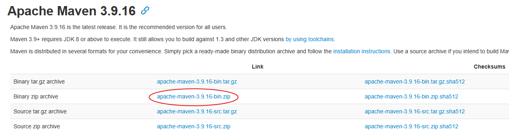
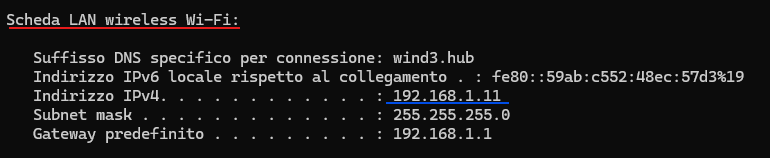
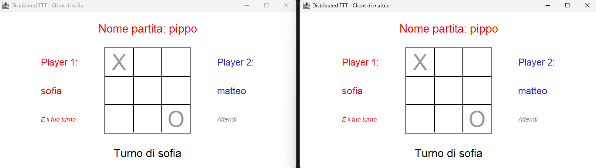
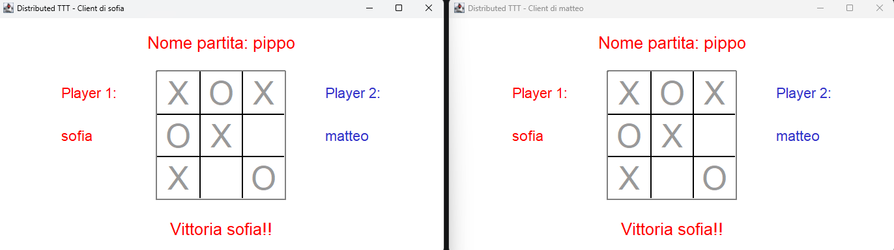

[](README.it.md)   [](README.md)
# ❌ Tic-Tac-Toe ⭕
*[Read this in English](README.md)*


Sistema distribuito per giocare a Tic-Tac-Toe, sviluppato per il corso di PCD.
## Da fare solo la prima volta 🖥️
Devi aver installato Maven!
https://maven.apache.org/download.cgi

Per esempio, puoi installare il seguente link (aggiornato settembre 2026):



Dopo l'installazione, estrai lo zip. Sposta la cartella all'interno del percorso `C:\Programmi` (la directory Programmi
o Programs presente in "Questo pc"). Successivamente, entra nelle directory fino a trovarti dentro `bin`.
Copia il percorso attuale.

Ora, imposta due variabili d'ambiente (cerca "Variabili d'ambiente" nelle impostazioni di Windows, poi modifica le Variabili di Sistema):

`MAVEN_HOME`: crea una nuova variabile con valore il percorso precedentemente copiato ma senza `bin`:
```
C:\Program Files\apache-maven-3.9.16-bin\apache-maven-3.9.16
```

`Path`: modifica la variabile esistente e aggiungi una nuova riga in fondo con il percorso 
precedentemente copiato:
```
C:\Program Files\apache-maven-3.9.16-bin\apache-maven-3.9.16\bin
```

(N.B. Gli esempi sopra sono copiabili solo per chi ha installato apache-maven-3.9.16 e ha correttamente
spostato il folder in `C:\Program Files`)


## Come avviare il progetto 💫
Nel primo terminale:
```
mvn clean
mvn compile
cd .\target\classes\
rmiregistry
```
 
Apri un secondo terminale per avviare il server:
```
java -cp target/classes main.java.server.RunServerTTT
```
 
Apri un terzo terminale per avviare un client (puoi usarlo, per esempio, per creare una nuova partita):
```
java -cp target/classes main.java.client.RunClientTTT
```
 
Apri un quarto terminale per avviare un altro client (stesso comando di prima. Puoi usarlo, per esempio, per
joinare la partita creata dal precedente client):
```
java -cp target/classes main.java.client.RunClientTTT
```

## Se ancora non funziona... 🔨

- Controlla che la source root sia solo `src`
- Controlla che il file `pom.xml` sia interpretato correttamente

## Partite su dispostivi diversi nella stessa rete LAN 🛜

È possibile utilizzare calcolatori diversi per giocare una stessa partita.

Passaggi fondamentali:
1. Un calcolatore designato alla funzione di server, eseguirà il comando
``` java -cp target/classes main.java.server.RunServerTTT <indirizzo-ip>```. 
L'indirizzo IP si può trovare eseguendo il comando `ipconfig` su un qualsiasi terminale 
2. Qualsiasi calcolatore appartenente alla rete LAN può connettersi come client eseguendo il comando
``` java -cp target/classes main.java.client.RunClientTTT <indirizzo-ip-server> ```, dove *indirizzo-ip-server* è
l'indirizzo del server precedentemente trovato
3. Tenere a mente che sia sul client che sul server, i passaggi preliminari sono gli stessi visti nei
precedenti paragrafi (maven deve essere correttamente installato e deve essere eseguito rmiregistry).

## Screenshots 📸

Partita in corso:


Partita terminata:
